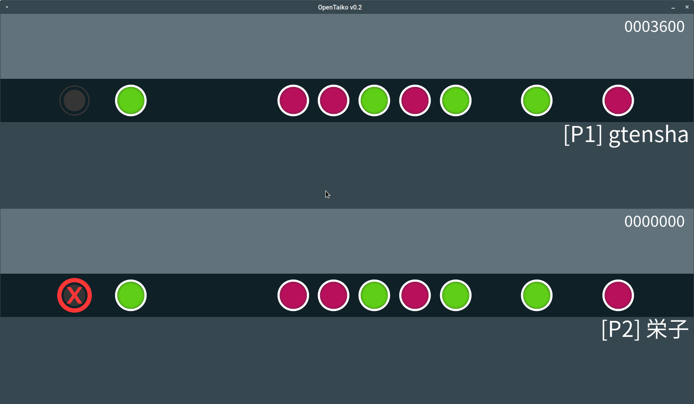

# OpenTaiko
OpenTaikoは、D言語とSDL2([DerelictSDL2][3])で書いてあげた太鼓の達人的なオープンソースゲームです。  

# コンパイル方法
コンパイルするにはD言語のDUBとDMDを使って、ファイルがダウンロードされたディレクトリで「dub　build」のコマンドを実行してください。持ってないなら[dlang.org][1]からダウンロードすることができます。Windowsを使ってる場合はその上に[libsdl.org][2]から様々な.dllファイルを手に入る必要もあります。SDL2の本ライブラリーとSDL_Mixer、SDL_Image、SDL_ttfの必要があります。Linuxの場合は同じようにディストリビューションのlibsdl2パッケージをインストールだけで十分でしょう。

ちゃんと楽しいゲームになったら、すでにコンパイルされた実行ファイルも配信することになります。

# 目的
どんなOSやデバイスでも遊ぶことができる太鼓の達人的なゲームとなるのはこのプロジェクトの目的です。古いや弱いハードを使ってもいいパフォーマンスができるとも大事な部分です。

テキストファイルをエディットして、簡単に好きな曲をゲーム譜面にされる機能も入ってます。他の一般的な譜面ファイルを使う可能にする機能や、色んなためのツールも未来でついてるかもしれません。

あと、投稿したいならぜひ！

[1]: http://dlang.org/
[2]: http://libsdl.org/
[3]: https://github.com/DerelictOrg/DerelictSDL2
