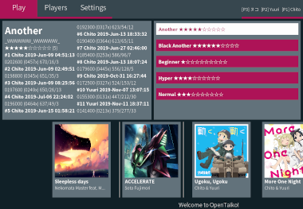
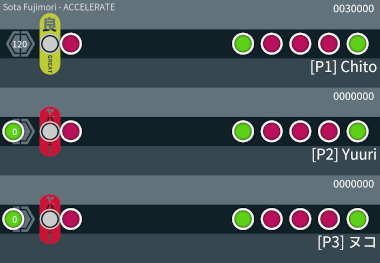

# OpenTaiko
Cross-platform drum rhythm game written in the D programming language using SDL2 ([DerelictSDL2][3]) for graphics and SFML2 ([DerelictSFML2][4]) for audio, available under the GNU GPLv3.

## Other languages
* [日本語 (Japanese)](README.jp.md)

## Screenshots





_(Screenshots do not necessarily represent the current state of the game)_

# Getting started
To start using OpenTaiko, you need a compiler, and the necessary dependencies. The acquisition method of these vary from platform to platform. There are currently no binary releases available, as not all the features related to such a release have been decided and implemented yet.

## Compiler
Both dmd and ldc are supported compilers, provided their version is rather recent. Compiling using dmd with the -release flag will generate a segfaulting binary; only debug builds are supported currently, due to a bug with dmd and derelict-sdl2. This should be fixed at a later time. ldc builds fine with -release.

## Dependencies
* dmd OR ldc
* dub
* SDL >= 2.0
* SDL2\_ttf
* SDL2\_image
* ffmpeg, the command line tool (optional, but highly recommended with csfml-audio-2 to automatically convert mp3 files in game)
* csfml-audio-2

csfml-audio-2 is available on all major platforms, and most of the minor platforms too. In case csfml-audio-2 is not available on your current platform, support with SDL2\_mixer is still implemented. You will need this library instead. Please note that music timing is not supported in this case, so the game may not function properly, and audio quality will be reduced (depending on the platform's implementation.)

## DUB dependencies
See [dub.sdl](dub.sdl).

## Platform-specific instructions
Feel free to add your own operating system specific instructions to this list.
If you already have any of the dependencies installed you may of course skip that step.

### Linux
OpenTaiko should compile and run on nearly any Linux distribution.

#### General
Use your package manager to find and install the dependencies listed in the _dependencies_ section. This is usually the extent of all you need to do.

#### Debian/Devuan (stable)
Debian buster now includes ldc 1.12; it's possible to use this compiler instead of dmd, and is recommended unless you need dmd's features. If you're running stretch or Devuan ascii, you need to follow the instructions for installing dmd further down below; don't install packages marked only for buster in this case. Use apt and install the following packages, if you haven't already:

* gcc (only for buster)
* ldc (only for buster)
* dub (only for buster)
* libsdl2-2.0-0
* libsdl2-image-2.0-0
* libsdl2-ttf-2.0-0
* libcsfml-audio2.5 (libcsfml-audio2.3 for stretch/ascii)
* ffmpeg

##### buster
The following command is only runnable as is on buster and will install ldc and dub from the official Debian repositories:

```
apt install gcc ldc dub libsdl2-2.0-0 libsdl2-image-2.0-0 libsdl2-ttf-2.0-0 libcsfml-audio2.5 ffmpeg
```

If you're running buster, you need to create a symlink to the installed libcsfml library, because derelict-sfml2 doesn't know to look for 2.5, only 2.4 and below. Place the link either in the project directory or in your /usr/lib equivalent directory as you see fit. Find and place the link in the current working directory with the following command:

```
ln --symbolic $(find /usr -name libcsfml-audio.so.2.5 | head -n 1) libcsfml-audio.so.2
```

##### stretch/ascii
If you are running stretch/ascii or older, you have to follow the steps below and use the [official installer](https://dlang.org/download.html) from dlang.org. 2.084 is known to work on stretch/ascii, but unless you're unsure you should get the newest version instead. Run the command below to download 2.084:

```
wget http://downloads.dlang.org/releases/2.x/2.084.0/dmd_2.084.0-0_amd64.deb
```

You should verify the .deb file with the associated .sig before you proceed any further. Run the following command to install the newly downloaded package:

```
sudo dpkg -i dmd_2.084.0-0_amd64.deb
```

#### Guix
Install, or add to your environment the following packages:

* ldc
* dub
* sdl2
* sdl2-ttf
* sdl2-image
* sfml
* ffmpeg

```
guix install ldc dub sdl2 sdl2-ttf sdl2-image sfml ffmpeg
```

...or just use them in the current terminal session:

```
guix environment --ad-hoc ldc dub sdl2 sdl2-ttf sdl2-image sfml ffmpeg
```

CSFML is not included in the official repositories, but you can easily download and build it automatically using [this package definition](https://gist.github.com/gtensha/d42f34e5276e2267c086cc8bd5bb82b2). Download and install it like so:

```
wget https://gist.github.com/gtensha/d42f34e5276e2267c086cc8bd5bb82b2/raw/3530f5ddf95281513c3bfcb7d964f31af5a19de5/csfml-guix.scm
guix package --install-from-file=csfml-guix.scm
```

### Windows
Download the dmd installer from [dlang.org](https://dlang.org/download.html#dmd) (the non-nightly Windows exe is recommended), and follow the installation instructions. You do not need any extras. Select "Do nothing" when prompted to choose Visual Studio Installation. You now have dmd and dub installed.

If you have git installed, you can use it to clone the OpenTaiko repository into your desired directory. If you only wish to test the game, you can download a zip archive instead, as installing and using git on Windows platforms can be tricky. If you chose the zip archive, extract it anywhere you like.

Next, download all the required .dll files and ffmpeg. If you have 64-bit Windows, download the 64-bit libraries, and if you have 32-bit, download the 32-bit ones.
Extract the archives and move the .dll files to the OpenTaiko directory. SDL2 includes several other .dll files; you need to move them all.

* [SDL2](http://libsdl.org/download-2.0.php)
* [SDL2-ttf](https://www.libsdl.org/projects/SDL_ttf/), latest version for Windows under "Runtime Binaries"
* [SDL2-image](https://www.libsdl.org/projects/SDL_image/), do as above, replace or keep zlib when prompted, it shouldn't matter
* [CSFML](https://www.sfml-dev.org/download/csfml/), latest version for Windows, Visual C++/GCC 32/64 bit. Only move the csfml-audio-2.dll file, found in the "bin" directory.

Once you have these moved, download [ffmpeg.exe](https://ffmpeg.zeranoe.com/builds/), latest version, your architecture, with static linking (but dynamic works as well). Find ffmpeg.exe in the "bin" directory in the zip archive. Do as above and place it in the OpenTaiko directory.

Install the [OpenAL redistributable](http://openal.org/downloads/oalinst.zip). In case you don't want to use the installer, you can download one of the [SFML builds](https://www.sfml-dev.org/download/sfml/2.5.1/) and use the openal32.dll included there, as the csfml builds do not bundle it and it is required for the library to work.

If you have successfully completed all the steps above, you may now compile OpenTaiko. Open a command prompt and navigate to the OpenTaiko directory; this can usually be done easily by copying from the address bar in Explorer and pasting it after the cd command (you may have to enclose the path in quotes if it contains spaces), e.g:

```
cd C:\Users\gtensha\Projects\OpenTaiko-0.2
```

Finally, to build OpenTaiko, run dub build with --arch=x86 (for 32-bit) or --arch=x86\_64 (for 64-bit), like so:

```
dub build --arch=x86_64
```

You may have to wait a couple of seconds the first time as dub fetches dependencies from the package archives; make sure you have a working internet connection during this time.

If the command succeeds, you will find OpenTaiko.exe has appeared in the directory. You may now run it, and hopefully you'll be able to play. If it crashes, go through the steps above once more, and check that you did everything correctly, especially note whether you downloaded 32-bit .dll files or 64-bit ones, as they must match your system architecture.

### BSD
BSD has not been tested but assuming you can get dmd working, it could work, as most BSDs supply the necessary libraries. Apply the same ideas as with Linux.

### MacOS
Use [homebrew](https://brew.sh/) and install the required packages.

## Building
dub is used to build OpenTaiko. dub should be run from your OS' command line, and the working directory set to whereever OpenTaiko was cloned/downloaded to.

```
dub run
```

...will build and run the game.

```
dub build
```

...will build only. If you wish to build with SDLMixer support (not recommended unless SFML libraries are unavailable) you need to use the --config=SDLMixer flag:

```
--config=SDLMixer
```

Adding this flag builds the game without SFML support, does not pull the DerelictSFML sources from dub and links against SDL_Mixer.

Running any of these commands will place a binary in the current working directory, which can be run directly afterwards. Without installing or setting the correct environment variables/command line flags, the binary must be run from the project directory or else it will fail to find assets and other essential files and directories.

In general, you do not need to specify the processor architecture you are building on, if you plan to compile for your current machine only. An exception is when building on 64-bit x86 Windows, where this must be specified.

```
--arch=x86_64
```

will build for 64-bit x86. You may combine these as you please:

```
dub build --config=SFMLMixer --arch=x86
```

...will build OpenTaiko with SFML2 audio support for 32-bit x86 (note that the --config=SFMLMixer option is redundant in this case.)

An internet connection is required when building for the first time, as dub dependencies must be downloaded. After that you may work offline as you please. It is also possible to download the code manually, see the links at the top of this document and the dub documentation for more details.

## Installing
If you have already built the game (or you got a prebuilt version) you can install the game on your machine by setting the appropriate environment variables and running the designated install script for your OS.

### Unix-like (install.sh)
By default, the game is installed with binaries in /usr/local/games and resource files in /usr/local/share/OpenTaiko. To change this behavior, you can set the following two environment variables before running the script. It is recommended that you store these environment variables in case you wish to uninstall later, for example by creating a "install-variables" file:

```
echo "export OPENTAIKO_BINARY_INSTALLDIR=/home/gtensha/bin" > install-variables
echo "export OPENTAIKO_RESOURCE_INSTALLDIR=/home/gtensha/share/OpenTaiko" >> install-variables
source install-variables
./install.sh
```

The series of commands above are examples of how one would perform a personal install in one's home directory. Make sure you install the binaries somewhere available on your PATH, and that the directories exist (the last directory only, OpenTaiko in this case, will be created if it does not exist.)

To uninstall, run the script again with the same environment variables and the --uninstall flag set:

```
source install-variables
./install.sh --uninstall
```

### Windows (install.bat)
Before installing, verify that the game runs and you have either installed the required .dll's globally or that they are present in the project directory. After that, you can run the script directly to install the game in %APPDATA%\Local\.opentaiko. You will get a shortcut to run the game in your start menu.

If you wish to change the install location, edit the script to reflect your preferred locations. You can find instructions in the comments of the file.

It is currently not possible to uninstall with this script, but all it takes is to delete the installation directory and the entry in the start menu.

## Playing the game
OpenTaiko is currently played with a keyboard. Game controller support is planned. You can play alone or with several other players, using the same keyboard (or different ones connected to the same computer.)

### Controls
Use a keyboard to navigate menus and play the game. Using a mouse is not supported.

Use the arrow keys to select menu options. Use the ENTER key to select a menu option, and ESCAPE will take you back to the previous menu or quit the game if pressed at the start screen. Use the TAB key when in the main menu to cycle the different menu sections.

By default, gameplay keys for player 1 are bound to the [D F J K] keys, where D is the left rim, F is the left center, and so on. Player 2 may use [End PageDown Numpad8 Numpad9].

#### Binding controls
Navigate to the _Players_ menu and select _Change keybinds_. Now you may select any registered player and change their keybinds, by pressing a key option followed by the desired key to bind. Press ESCAPE at any time to cancel.

Keybinds are stored as arrays in _keybinds.json_, which you may edit by hand if you please. Keybinds are player number specific, and not associated with a single player.

If you wish to clear the keybinds for a specified player number, use the designated option in the _Players_ menu.

### Adding players
By default you'll have one player, _Player_. You can add more players by navigating to the _Players_ menu and selecting _Add player_. Now you may select from the list of previously registered players, or register a new one. When you add a player, they will get their own player area when you select a map and will be able to play together with you. The currently selected players can be seen in the top right corner.

Using the _Remove player_ option, you may remove players from the current game session. Removing players does not delete them from the list of registered players.

Registered players are stored in the _players.json_ file. You may edit this by hand if you please.

### Adding maps
To add maps, you can either map some yourself, get a map someone else has mapped already, or import a map from a different game.

#### Creating your own map
This is a work in progress, as you must currently do everything manually. Look in the maps directory and inspect the included maps for details on how to create a map.

To use a map someone has created already, copy its directory to the maps directory, as seen with the included examples.

#### Importing maps
You can import a map from a .osz archive if you have one. It will convert the beatmap to the OpenTaiko fumen format, and convert the mp3 within to a ogg file with ffmpeg. If you don't have ffmpeg you may not be able to play the song in game afterwards. Unlike the game this type of beatmap originates from, the archive will not be deleted after import.

To import a map, navigate to the _Settings_ menu, and select _Import map_.

### Configuring the game
In the _Settings_ menu you may change the language and set the vsync mode. To change resolution, edit the value in _settings.json_ to match your preferred value. Changing any option currently requires you to restart the game for them to take effect.

### Gameplay
Hit the drum circles as they approach the reception area. Hit the red circles with your left or right middle keys, and likewise, the green circles with your rim keys. The better the timing, the better the score. Following the music is the key!

More gameplay elements will be added as development progresses.

# Goals
OpenTaiko is to be a platform agnostic drum rhythm game that works well on most hardware, including old and/or weak hardware, as well as cutting-edge systems.

The game should be easy and straightforward to use. It should have fun and intuitive features, splitscreen and network multiplayer support, and support different map formats provided by other, similar games.
Its own native map format should be easily editable through a text file, while providing means to make the whole process as painless as possible.

The code should eventually be robust and easy to understand, so that anyone can easily work on the game and its code. But in the meantime, contributions are still welcome, there's a lot to be improved and implemented.

OpenTaiko is free software licensed under the GNU GPLv3. Therefore the components used to make the game must be free as well, so the game could be distributed in both binary and code form entirely as free software.

# Copyright notice
These files are included in the repository and subject to copyright by their respective owners:

## Noto fonts
**Copyright © 2010-2015, Google Corporation**

### Files

* assets/default/NotoSansCJK-Bold.ttc
* assets/default/NotoSansCJK-Light.ttc
* assets/default/NotoSansCJK-Regular.ttc

### License
[SIL Open Font License](assets/default/LICENSE.NotoSansCJK.txt)

### Project link
[GitHub repository](https://github.com/googlei18n/noto-cjk)

[3]: https://github.com/DerelictOrg/DerelictSDL2
[4]: https://github.com/DerelictOrg/DerelictSFML2
